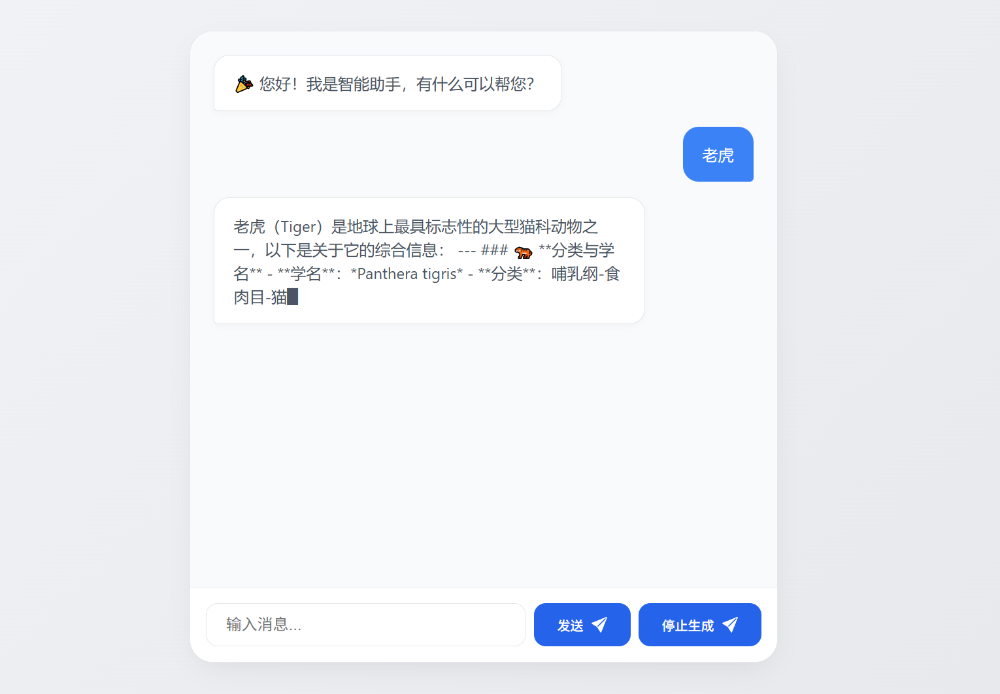

# AI智能聊天

## 项目概述

基于Python的Flask框架开发的交互式聊天界面，实现与AI助手的自然语言对话功能

## 核心功能

• 实时对话：支持文本输入与即时响应
• 智能格式化：自动解析Markdown语法（标题/列表/加粗文本）
• 错误处理：网络请求失败自动提示
• 响应式设计：适配不同设备屏幕

## 技术栈

• 原生JavaScript 
• Fetch API进行异步通信
• CSS3动画与过渡效果
• python语法

## 文件结构

/static
├── css          # css文件夹
├── js             # js文件夹
└── imgs       # imgs文件夹

/templates
├── home.html       # 聊天室页
├── index.html       # 首页
└── login.html        # 登录

main.py  主入口

## 特色实现

动态消息渲染：addMessage()函数智能区分用户/AI消息
交互优化：
发送按钮状态管理
回车键快捷发送
滚动条自动定位

## 安装与使用

克隆仓库：

```shell
git clone https://github.com/luckyNwa6/FlaskAIChat.git
```

启动本地服务




## 未来扩展

• 支持图片/文件上传
• 对话历史保存
• 支持Markdown格式内容智能解析与展示